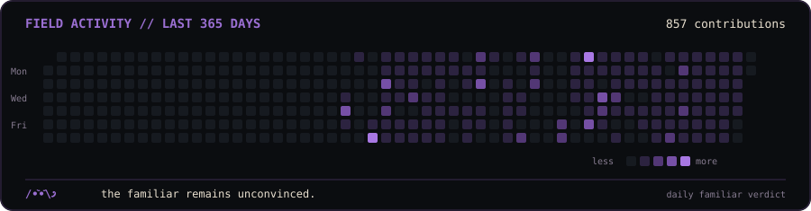
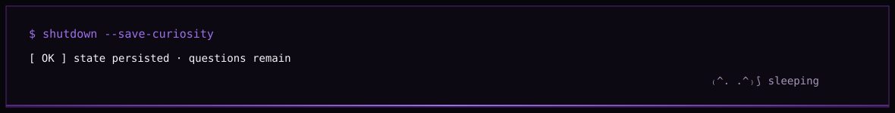

<p align="center">
  
</p>

## `01 // IDENTITY`

```text
root@portfolio:~$ whoami
```

Information Security student at THWS Würzburg with a focus on offensive security, secure software engineering, and systems that become more interesting precisely where their assumptions begin to fail.

I care less about collecting shells than understanding the broken assumption that made them possible, how the weakness can be reproduced, and what a real fix should look like.

```text
current signal  building security tools
                documenting labs
                expanding the home lab
                working toward deeper offensive-security practice
```

---

## `02 // PROJECT ARCHIVE`

```text
root@portfolio:~$ ls ~/projects
```

<p align="center">
  <a href="https://github.com/Denis-Krueger-labs/home-lab"></a>&nbsp;<a href="https://denis-krueger-labs.github.io/Portfolio/"></a>
</p>

<p align="center">
  <a href="https://github.com/Denis-Krueger-labs/Wing-FTP-CVE"></a>&nbsp;<a href="https://github.com/Denis-Krueger-labs/copy-fail-lab"></a>
</p>

<p align="center">
  <a href="https://github.com/Denis-Krueger-labs/decup"></a>&nbsp;<a href="https://github.com/Denis-Krueger-labs/KMU-IT-OT-Network-Security-Lab"></a>
</p>

<p align="center">
  <a href="https://github.com/Denis-Krueger-labs/Road-To-CWES"></a>&nbsp;<a href="https://github.com/Denis-Krueger-labs/llm-prompt-injection-paper"></a>
</p>

---

## `03 // ADDITIONAL BUILDS`

```text
root@portfolio:~$ find ~/projects -maxdepth 1 -type d
```

<p align="center">
  <a href="https://github.com/Denis-Krueger-labs/pwgen-lite"></a>&nbsp;<a href="https://github.com/Denis-Krueger-labs/mfind"></a>
</p>

<p align="center">
  <a href="https://github.com/Denis-Krueger-labs/writeups"></a>&nbsp;<a href="https://github.com/Denis-Krueger-labs/fixdesk"></a>
</p>

<p align="center">
  <a href="https://github.com/Denis-Krueger-labs/blue."></a>&nbsp;<a href="https://github.com/Denis-Krueger-labs/letters-from-the-deep"></a>
</p>

---


<table>
<tr>
<td width="50%" valign="top">
<h2><code>04 // METHODOLOGY</code></h2>

```text
root@portfolio:~$ cat methodology.md

Reconnaissance
→ Enumeration
→ Vulnerability identification
→ Exploitation and validation
→ Privilege escalation
→ Root-cause analysis
→ Remediation and documentation
```

The goal is not merely to prove that something breaks, but to explain why it breaks, what assumption failed, how the finding can be reproduced safely, and how the weakness should be fixed.
</td>
<td width="50%" valign="top">
<h2><code>05 // INSTALLED PACKAGES</code></h2>

```text
root@portfolio:~$ pacman -Q
```

````html
<td width="50%" valign="top">
<h2><code>05 // INSTALLED PACKAGES</code></h2>

```text
root@portfolio:~$ pacman -Q
````

<strong>Languages</strong><br>


<strong>Security</strong><br>


<strong>Systems & Development</strong><br>


</td>
```


</td>
</tr>
</table>

---

## `06 // JOURNALCTL`

```text
root@portfolio:~$ journalctl --since "365 days ago"
```

<p align="center">
  
</p>

<p align="center">
  &nbsp;
</p>

---

## `07 // KNOWN ROUTES`

```text
root@portfolio:~$ ls ~/known-routes
```

<p align="center">
  <a href="https://www.linkedin.com/in/denis-krüger-882520354/">
    
  </a>
  <a href="https://discord.com/users/536248721189371904">
    
  </a>
  
  <a href="https://tryhackme.com/p/0N1S3C">
    
  </a>
  <a href="https://profile.hackthebox.com/profile/019c7d76-1e97-73d7-90de-5861d7eb8087">
    
  </a>
</p>

---

<p align="center">
  
</p>

<!--
curiosity survives containment
systems reveal themselves to those who keep asking why
information wants to be free
-->


