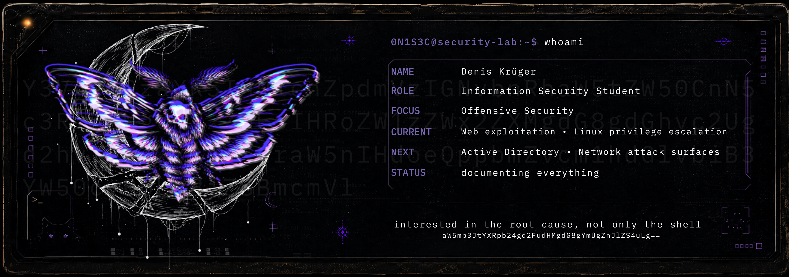

<p align="center">
  
</p>

## `01 // ABOUT`

Information Security student at THWS Würzburg with a focus on offensive security.
I care less about collecting shells than understanding the broken assumption that made them possible, how the weakness can be reproduced, and what a real fix should look like.

Current work revolves around web exploitation, Linux privilege escalation, security tooling, and technical documentation. Active Directory and broader network attack surfaces are next on the list. Labs, projects, and research notes get written down instead of disappearing into terminal history.

`current signal:` building security tools, documenting labs, and steadily working toward deeper offensive-security practice.

---

## `02 // SELECTED OPERATIONS`

### [Road to CWES](https://github.com/Denis-Krueger-labs/road-to-cwes) · [Live site](https://denis-krueger-labs.github.io/Road-To-CWES/)

`Offensive Security` · `Web Exploitation` · `Learning Journal`

A public learning journal documenting the path toward the Certified Web Exploitation Specialist. It combines daily study logs, practical labs, reusable templates, and the reasoning behind each technique rather than recording commands without context.

### [LLM Prompt Injection Defences](https://github.com/Denis-Krueger-labs/llm-prompt-injection-paper)

`Security Research` · `LLM Security` · `Academic Writing`

A seminar paper examining prompt-injection vulnerabilities in LLM-integrated systems and evaluating current defence approaches, including structured queries, alignment-based methods, spotlighting, and system-level information-flow controls. The paper focuses on the underlying instruction/data boundary problem and the limits of current defences under adaptive attacks.

### Decup

`C#` · `.NET` · `P2P Systems` · `Applied Cryptography`

A decentralized peer-to-peer backup and restore prototype built as a six-person university project. The system includes peer discovery, signed identities, routed messaging, chunked payload transfer, checksum validation, replication target selection, restore ownership checks, a guided terminal interface, and an extensive automated test suite.

### Wing FTP Security Lab

`Vulnerability Research` · `Exploit Validation` · `Mitigation Testing`

A controlled lab assessment of Wing FTP Server 7.4.3 covering service discovery, exploit reproduction, impact validation, and mitigation testing through a reverse proxy and web application firewall. Evidence and defensive observations were recorded alongside the offensive workflow.

### ReportForge Sec

`Python` · `YAML` · `CLI/TUI` · `Security Reporting`

An open-source reporting tool in active development that turns structured assessment data into consistent security reports. The project is designed around reproducible findings, evidence handling, validation, and a terminal familiar with opinions.

### [Portfolio](https://denis-krueger-labs.github.io/Portfolio/)

`React` · `TypeScript` · `Vite` · `Design Systems`

A custom-built portfolio that presents security work, software projects, research, and learning progress through a deliberately non-corporate terminal-inspired interface.

---

## `03 // ADDITIONAL BUILDS`

### [pwgen-lite](https://github.com/Denis-Krueger-labs/pwgen-lite)

A compact Python password generator built around secure randomness and cryptographic correctness. It includes a deterministic HMAC-SHA256 mode, rejection sampling to avoid modulo bias, entropy estimates, brute-force modelling, tests, and proper CLI exit behaviour.

### [mfind](https://github.com/Denis-Krueger-labs/mfind)

A simplified implementation of the Unix `find` utility written in C. It supports recursive traversal, filters for name, type, size, and depth, optional parallel traversal using POSIX threads, and was verified memory-safe with Valgrind.

### [writeups](https://github.com/Denis-Krueger-labs/writeups)

Structured technical reports for Hack The Box and TryHackMe labs. Each report follows a repeatable methodology covering reconnaissance, enumeration, exploitation, privilege escalation, evidence, and defensive considerations.

### FixDesk

A React and TypeScript repair-shop frontend featuring customer, device, and repair-order workflows, reusable data-table components, search, pagination, forms, confirmation flows, and backend integration.

### Blue.

An editorial-brutalist festival website built in React, combining custom visual design, responsive layout work, motion, theme switching, and a deliberately unconventional presentation style.

---

## `04 // METHODOLOGY`

```text
Reconnaissance
    ↓
Enumeration
    ↓
Vulnerability identification
    ↓
Exploitation and validation
    ↓
Privilege escalation
    ↓
Root-cause analysis
    ↓
Remediation and documentation
```

The goal is not merely to prove that something breaks. The goal is to explain why it breaks, what assumptions failed, how the finding can be reproduced safely, and how the weakness should be fixed.

---

## `05 // FIELD ACTIVITY`

<p>
  <a href="https://tryhackme.com/p/0N1S3C">
    
  </a>
</p>

<p>
  <a href="https://app.hackthebox.com/public/users/3188353">
    
  </a>
</p>

---

## `06 // TOOLCHAIN`

**Languages:** Python · C · C# · Bash · Java · SQL · TypeScript  
**Security:** Kali Linux · Burp Suite · Nmap · Gobuster · ffuf · SQLMap · Metasploit · Wireshark · OWASP ZAP  
**Systems & Development:** Linux · Git · GitHub Actions · .NET · React · Vite · Docker

---

## `07 // LINKS`

[Portfolio](https://denis-krueger-labs.github.io/Portfolio/) ·
[Road to CWES](https://denis-krueger-labs.github.io/Road-To-CWES/) ·
[TryHackMe](https://tryhackme.com/p/0N1S3C) ·
[Hack The Box](https://app.hackthebox.com/public/users/3188353)

---

```text
/•᷅‎‎•᷄\੭  source inspected. suspicious.
```

<!--
curiosity survives containment
systems reveal themselves to those who keep asking why
information wants to be free
-->
